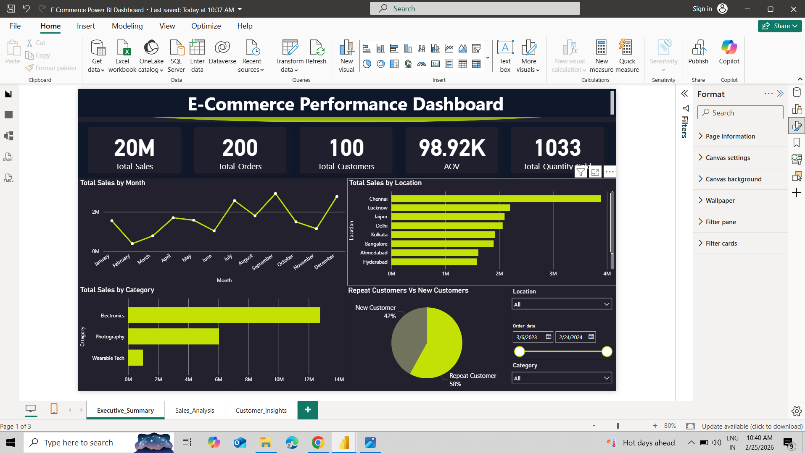
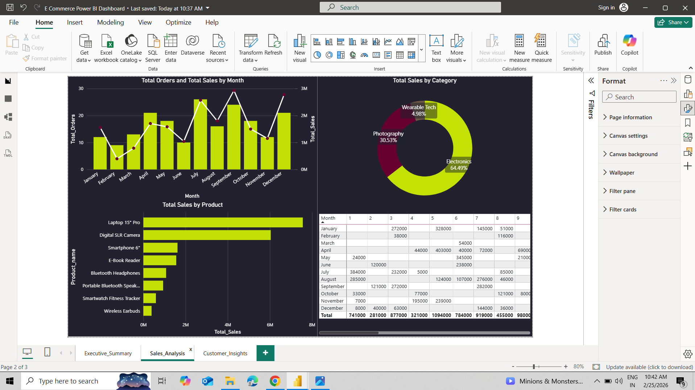
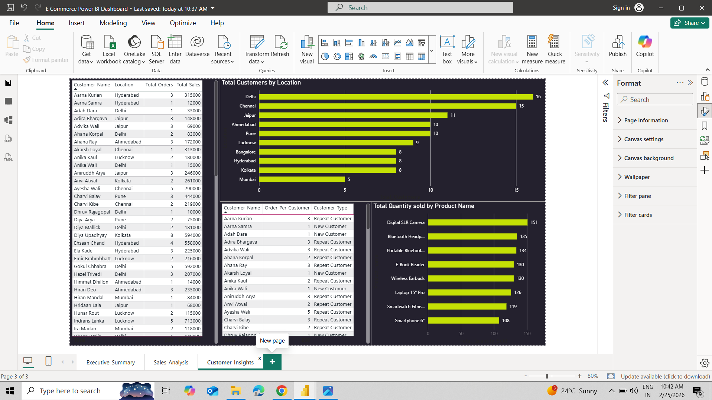

# 🛒 E-Commerce Performance Dashboard | Power BI

## 📌 Project Overview
This project presents an interactive **E-Commerce Performance Dashboard** built in Power BI to analyze sales performance, customer behavior, and product trends.  
The dashboard enables business stakeholders to monitor KPIs, identify top-performing categories, and track customer patterns for data-driven decision-making.

---

## 🎯 Objectives
- Monitor overall sales and order performance  
- Analyze monthly sales trends  
- Identify top-performing locations and categories  
- Understand customer retention (New vs Repeat)  
- Track product-level performance  

---

## 📊 Key Insights
- 💰 Total Sales reached **20M**
- 📦 Total Orders recorded **200**
- 👥 Total Customers: **100**
- 🔁 Repeat customers contribute **58%** of business
- 🏆 Electronics category dominates total sales
- 📈 Sales show fluctuating but overall upward monthly trend

---

## 🚀 Dashboard Features
- ✅ Interactive KPI Cards  
- ✅ Monthly Sales Trend (Line Chart)  
- ✅ Sales by Location Analysis  
- ✅ Category-wise Performance  
- ✅ Repeat vs New Customer Analysis  
- ✅ Product Performance View  
- ✅ Dynamic Slicers (Location, Date, Category)  
- ✅ Dark-themed professional UI  

---

## 🛠 Tools & Technologies
- Power BI  
- Power Query  
- DAX  
- Data Modeling  
- Data Visualization  

---

## 📷 Dashboard Preview

### Executive Summary

### Sales Analysis

### Customer Insights

---

## 💼 Business Value
This dashboard helps e-commerce stakeholders to:
- Improve customer retention strategies  
- Optimize product and category focus  
- Monitor regional sales performance  
- Support data-driven business decisions  

---

## 👨‍💻 Author
**Rajendra Thakre**  
Aspiring Data Analyst | Power BI Developer  

📢 Open to Data Analyst / Power BI opportunities
